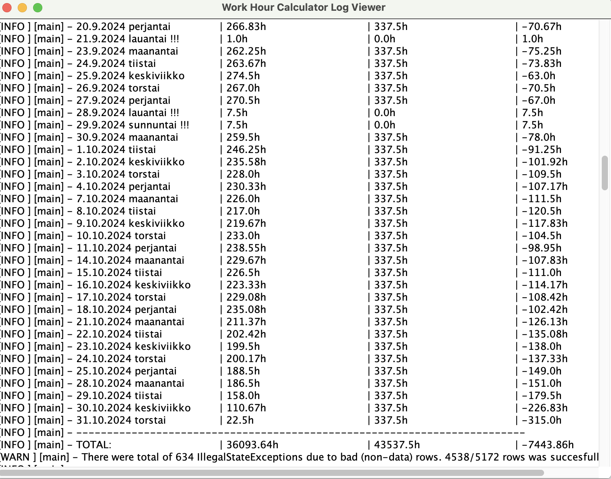

# Build

```
mvn clean compile assembly:single
```
# Usage

Put xlsx files in the same root directory as the jar. Xlsx files can be also located in directories e.g. in "./data/". Start the jar.

```
java -jar whc-0.0.1-SNAPSHOT.jar
```